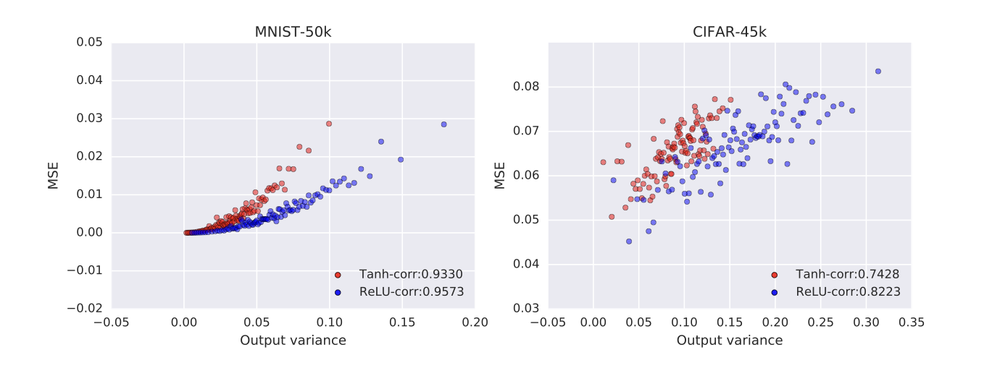
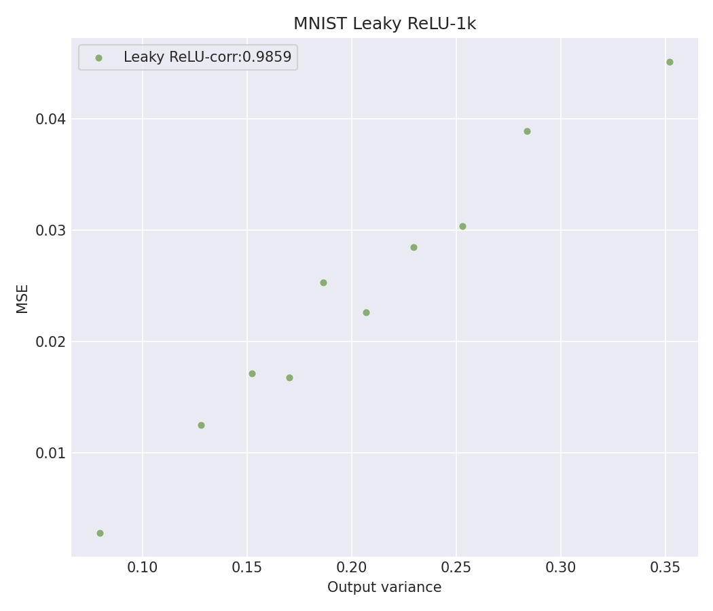

# Project 2:

This project reproduces the predictive uncertainty experiment from Figure 3 of Lee et al. (2018), *Deep Neural Networks as Gaussian Processes*. The experiment investigates whether the predictive uncertainty produced by a Neural Network Gaussian Process (NNGP) corresponds to actual prediction error.

The reproduction uses the MNIST dataset with 1,000 training examples and 1,000 evaluation examples. Predictive variance and mean squared error are grouped into bins of 100 examples, producing 10 plotted observations for each activation function. Results are shown for the Tanh and ReLU nonlinearities. Because the original Figure 3 uses a larger evaluation set, my reproduction is less dense than the original figure. However, it still reproduces the positive relationship between predictive variance and prediction error.

## Figure 3 Reproduction

<table>
  <tr>
    <th>Original Figure 3</th>
    <th>Reproduction</th>
  </tr>
  <tr>
    <td></td>
    <td></td>
  </tr>
</table>

## Reproduction Instructions

The experiment is fully containerized with Docker. From a clean clone of this repository, build and run the project with:

```bash
git clone https://github.com/andreaycaceres/nngp-project.git
cd nngp-project
docker build -t nngp-project .
docker run nngp-project
```

The default Docker command runs the MNIST Figure 3 reproduction using 1,000 training examples, 1,000 evaluation examples, Tanh and ReLU nonlinearities, depth 3, weight variance 2.0, and bias variance 0.2. The generated figure is saved inside the container as:

```text
/nngp/output/uncertainty_fig3_mnist.png
```

To save the generated figure directly to the host machine, create an output directory and mount it when running the container:

```bash
mkdir -p output
docker run --platform linux/amd64 \
  -v "$(pwd)/output":/nngp/output \
  nngp-project
```

The reproduced results show the same general relationship demonstrated in Figure 3: examples with greater NNGP predictive variance also tend to have greater prediction error. Both Tanh and ReLU show a strong positive relationship between predictive uncertainty and mean squared error.
## Unique Extension: Leaky ReLU


## Discussion, Limitations, & Results
For my unique extension, I decided to use an activation function that was not tested in the paper. The additional activation function I chose for the NNGP implementation is Leaky ReLU. A standard ReLU outputs a zero value for all negative inputs, meanwhile a Leaky ReLU allows a small negative slope. The goal for using this activation is to determine whether the relationship between predictive uncertainty and prediction error from Figure 3 would still appear. 
	For Leaky ReLU, I used an alpha level of 0.1 which multiplies negative inputs by this alpha value. In the code under uncertainty_plot.py, I added the Leaky ReLU activation function using tf.nn.leaky_relu(x, alpha = 0.1). Since NNGP kernel accepts a TensorFlow function, I could pass Leaky ReLU directly as the nonlinearity component without having to re-code the algorithm. I decided to keep the same setup as the original experiment to compare the difference in relationships between the different activation functions. During this unique extension, I came across an issue where there was not a precomputed grid for Leaky ReLU. The grid is the precomputed numerical lookup table used to make the NNGP kernel calculations. When my computer tried to generate one for Leaky ReLU, it came across a memory issue and failed. To fix this problem, I reduced the grid settings from 501 Gaussian quadrature points, 501 variance points, and 500 correlation points to 101 Gaussian quadrature points, 101 variance points, and 100 correlation points.
	The Leaky ReLU figure that I generated showed a strong positive correlation between the predicted variance and the mean squared error and a correlation of approximately 0.9859 across the binned observations. This tells us that the model reported more uncertainty on groups where it made larger errors. Therefore, for this experiment, the Leaky ReLU NNGP showed a strong relationship between predictive uncertainty and prediction error. The relationship in the original Figure 3 from the paper is similar to the relationship using Leaky ReLU in this MNIST experiment. 

### Running the Leaky ReLU Extension

To reproduce the Leaky ReLU extension, run:

```bash
mkdir -p output
docker run --platform linux/amd64 \
  -v "$(pwd)/output":/nngp/output \
  nngp-project \
  --dataset=mnist \
  --num_train=1000 \
  --num_eval=1000 \
  --hparams=depth=3,weight_var=2.0,bias_var=0.2 \
  --nonlinearities=leaky_relu \
  --n_gauss=101 \
  --n_var=101 \
  --n_corr=100 \
  --output_file=/nngp/output/uncertainty_fig3_leaky_relu.png
```

This generates the Leaky ReLU extension figure at:

```text
output/uncertainty_fig3_leaky_relu.png
```

# NNGP: Deep Neural Network Kernel for Gaussian Process

TensorFlow open source implementation of

[**Deep Neural Networks as Gaussian Processes**](https://arxiv.org/abs/1711.00165)


by Jaehoon Lee*, Yasaman Bahri*, Roman Novak, Sam Schoenholz, Jeffrey Pennington,
Jascha Sohl-dickstein

Presented at the International Conference on Learning Representation(ICLR) 2018.

## UPDATE (September 2020):
See also [Neural Tangents: Fast and Easy Infinite Neural Networks in Python](https://arxiv.org/abs/1912.02803) (ICLR 2020)
available at [github.com/google/neural-tangents](https://github.com/google/neural-tangents) for 
more up-to-date progress on computing NNGP as well as NT kernels supporting wide variety of architectural components.


## Overview
A deep neural network with i.i.d. priors over its parameters is equivalent to a 
Gaussian process in the limit of infinite network width. The Neural Network
Gaussian Process (NNGP) is fully described by a covariance kernel determined by 
corresponding architecture.

This code constructs covariance kernel for the Gaussian process that is equivalent to
infinitely wide, fully connected, deep neural networks. 

## Usage

To use the code, run `run_experiments.py`,
which uses NNGP kernel to make full Bayesian prediction on the MNIST dataset.


```python
python run_experiments.py \
       --num_train=100 \
       --num_eval=10000 \
       --hparams='nonlinearity=relu,depth=100,weight_var=1.79,bias_var=0.83' \
```

## Contact
***Code author:*** Jaehoon Lee, Yasaman Bahri, Roman Novak

***Pull requests and issues:*** @jaehlee

## Citation
If you use this code, please cite our paper:
```
  @article{
    lee2018deep,
    title={Deep Neural Networks as Gaussian Processes},
    author={Jaehoon Lee, Yasaman Bahri, Roman Novak, Sam Schoenholz, Jeffrey Pennington, Jascha Sohl-dickstein},
    journal={International Conference on Learning Representations},
    year={2018},
    url={https://openreview.net/forum?id=B1EA-M-0Z},
  }
```

## Note

This is not an official Google product.
